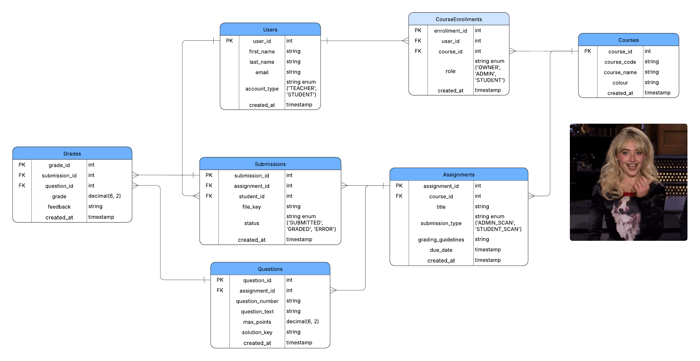

# ClearMark Backend

An AI-powered educational assessment and grading platform backend API.

## Overview

ClearMark is a course management and automated grading system designed for educators to create courses, manage assignments, accept student submissions, and leverage Google Gemini AI for intelligent automated grading.

## Features

- **Course Management** - Create and manage courses with enrolled students
- **Assignment Creation** - Build assignments with structured questions, solution keys, and grading guidelines
- **PDF Submissions** - Accept PDF submissions from students (up to 50MB)
- **AI-Powered Grading** - Automatically grade submissions using Google Gemini AI
- **Manual Grade Override** - Instructors can manually adjust grades and feedback
- **CSV Export** - Export all grades and submissions for an assignment
- **Role-Based Access** - Support for Owner and Student roles within courses

## Tech Stack

| Component | Technology |
|-----------|------------|
| Runtime | Node.js |
| Framework | Express 5.x |
| Database | PostgreSQL (Neon) |
| File Storage | Cloudflare R2 |
| AI Service | Google Gemini 2.5-flash |
| Deployment | Render |

## Database Schema



### Tables

Users, Courses, CourseEnrollments, Assignments, Questions, Submissions, Grades

## API Endpoints

### Health Check

| Method | Endpoint | Description |
|--------|----------|-------------|
| GET | `/health` | Health check (no auth required) |

### Users

| Method | Endpoint | Description |
|--------|----------|-------------|
| POST | `/api/users` | Create a new user |
| GET | `/api/users/check-exists/:email` | Check if user exists by email |
| POST | `/api/users/classes` | Get all courses owned by a user |

### Courses

| Method | Endpoint | Description |
|--------|----------|-------------|
| POST | `/api/courses` | Create a new course |
| GET | `/api/courses/:courseId` | Get course details with assignments and enrolled users |
| DELETE | `/api/courses/:courseId` | Delete a course |

### Enrollments

| Method | Endpoint | Description |
|--------|----------|-------------|
| POST | `/api/enrollments` | Enroll a user in a course |
| DELETE | `/api/enrollments/:enrollmentId` | Remove a user from a course |
| PUT | `/api/enrollments/role` | Update user role (OWNER/STUDENT) |

### Assignments

| Method | Endpoint | Description |
|--------|----------|-------------|
| POST | `/api/assignments` | Create a new assignment |
| GET | `/api/assignments/:assignmentId` | Get assignment details with questions, users, and grades |
| GET | `/api/assignments/:assignmentId/export` | Export all submissions and grades as CSV |

### Questions

| Method | Endpoint | Description |
|--------|----------|-------------|
| POST | `/api/questions` | Create a question in an assignment |
| PUT | `/api/questions` | Update a question |
| DELETE | `/api/questions/:questionId` | Delete a question |

### Submissions & Grading

| Method | Endpoint | Description |
|--------|----------|-------------|
| POST | `/api/users/:userId/assignments/:assignmentId/upload` | Upload PDF submission |
| GET | `/api/assignments/:assignmentId/students/:studentId/submission` | Get student submission details and grades |
| GET | `/api/assignments/:assignmentId/user/:userId/ai-grading` | Trigger AI grading |
| PUT | `/api/grades` | Manually update grades and feedback |

## Getting Started

### Prerequisites

- Node.js (v18 or higher recommended)
- PostgreSQL database (or Neon account)
- Cloudflare R2 bucket
- Google AI API key (Gemini)

### Installation

1. Clone the repository:
   ```bash
   git clone https://github.com/ClearMarkApp/backend.git
   cd backend
   ```

2. Install dependencies:
   ```bash
   npm install
   ```

3. Create a `.env` file with the required environment variables (see below)

4. Start the server:
   ```bash
   npm start
   ```

   For development with auto-reload:
   ```bash
   npm run dev
   ```

### Environment Variables

Create a `.env` file in the root directory with the following variables:

```env
# Server
PORT=3000

# API Authentication
API_KEY=your-api-key

# PostgreSQL (Neon)
PGHOST=your-neon-host
PGDATABASE=your-database-name
PGUSER=your-database-user
PGPASSWORD=your-database-password

# Cloudflare R2
R2_ACCOUNT_ID=your-r2-account-id
R2_BUCKET_NAME=your-bucket-name
R2_ACCESS_KEY_ID=your-r2-access-key
R2_SECRET_ACCESS_KEY=your-r2-secret-key
R2_PUBLIC_URL=your-r2-public-url

# Google Gemini AI
GEMINI_API_KEY=your-gemini-api-key
```

## Authentication

All API endpoints (except `/health`) require authentication via the `x-api-key` header:

```bash
curl -H "x-api-key: your-api-key" https://your-api-url/api/courses
```

## AI Grading Workflow

1. **Setup** - Create an assignment with questions, solution keys, and grading guidelines
2. **Submit** - Student uploads a PDF submission
3. **Grade** - Trigger AI grading via the `/ai-grading` endpoint
4. **Process** - Gemini AI analyzes the PDF against solution keys and guidelines
5. **Store** - Grades and feedback are saved to the database
6. **Review** - Instructors can review and manually adjust grades if needed

## Architecture

```
Client Request
    │
    ▼
Express Server (server.js)
    │ [API Key Auth Middleware]
    ▼
Routes (api_routes.js)
    │
    ▼
Controllers (GET/POST/PUT/DELETE)
    │
    ▼
Services & External APIs
    ├── Database (PostgreSQL/Neon)
    ├── File Storage (Cloudflare R2)
    └── AI Grading (Google Gemini)
```

## Deployment

This project is configured for deployment on Render. See `render.yaml` for configuration details.
